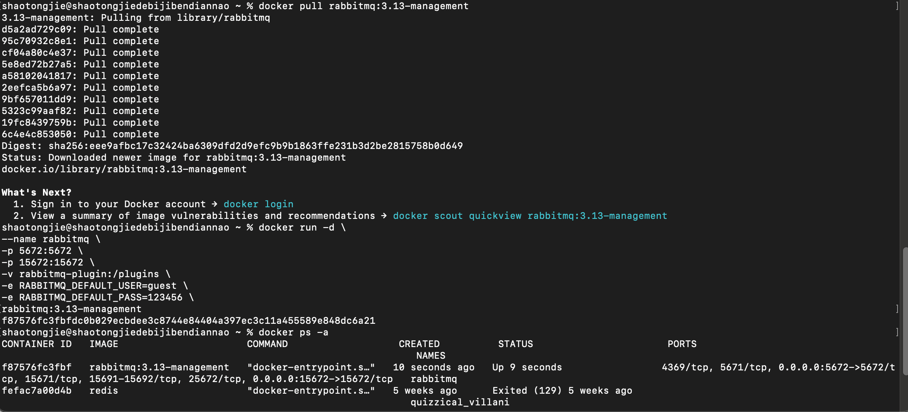

[TOC]

Hi，大家好，我是千羽。

今天学习一下消息队列，工作上也有用redis作为队列的。

完整代码，已经放到GitHub：

## 一、什么是消息队列

> 消息队列是实现**应用程序**和**应用程序**之间**通信**的中间件产品

消息队列（Message Queue）是一个在计算机科学中广泛使用的概念，主要用于**异步通信、应用解耦、流量削峰**等场景。

简单来说，它就像是一个快递小哥，把快递送到**牛马打工人**手中就去下个站点配送，**牛马打工人**什么时候下来拿快递，不需要管了。

以快递小哥为例，我们可以这样理解消息队列：

1. **快递小哥（消费者）**：负责接收和派送包裹（消息）的人。
2. **快递公司（消息队列系统）**：负责管理包裹的存放和分发，确保包裹能够准确无误地送达给收件人。
3. **寄件人（生产者）**：需要将包裹寄送给收件人的人，他们会将包裹送到快递公司的某个网点或邮筒。
4. **邮筒（队列）**：存放包裹的地方，可以是快递公司的一个实体网点，也可以是一个虚拟的存储空间（在内存中或持久化到磁盘上）。


现在，我们来看看这个场景是如何工作的：

1. 寄件人（**生产者**）将包裹（**消息**）投放到快递公司的某个网点或邮筒（**队列**）中，并指定收件人的地址。
2. 快递公司（**消息队列系统**）会接收这个包裹，并将其存放到相应的邮筒（**队列**）中。
3. 快递小哥（**消费者**）会定期或实时地从邮筒（**队列**）中取出包裹，并根据收件人的地址进行派送。
4. 如果包裹太多，一个快递小哥忙不过来，快递公司可以安排多个快递小哥（**多个消费者**）来同时处理这些包裹。

这个例子中，消息队列的优势主要体现在以下几个方面：

* **异步通信**：寄件人（生产者）和收件人（消费者）不需要实时在线，他们可以通过快递公司（消息队列系统）进行异步通信。
* **应用解耦**：快递公司（消息队列系统）作为中间层，将寄件人（生产者）和收件人（消费者）解耦，使得他们可以独立地扩展和修改。
* **流量削峰**：在高峰期，大量的包裹可能会同时到达快递公司，但快递公司可以通过邮筒（队列）进行缓冲，避免系统崩溃，并确保包裹能够有序地派送。

## 二、同步与异步的场景


| 同 步                        | 异 步                                    |
| ---------------------------- | ---------------------------------------- |
| 系统耦合度高                 | 参与的各功能模块相对独立，耦合度低       |
| 并发压力持续向后续服务传导   | 借助消息队列实现流量削峰填谷             |
| 系统结构缺乏弹性，可扩展性差 | 各功能模块对接消息队列，系统功能扩展方便 |
| 响应时间长                   | 快速响应                                 |

注 意

1.  并不是把所有交互方式都改成异步
    • **强关联**调用还是通过OpenFeign进行

2. 同步调用
    • **弱关联**、**可独立拆分出来**的功能使用


## 三、RabbitMQ介绍

官网地址：https://www.rabbitmq.com/

RabbitMQ是一款**基于AMQP**、由Erlang语言开发的消息队列产品，2007年 Rabbit技术公司发布了它的1.0版本

Producer：消息的发送端，也可以称为消息的生产者

Consumer：消息的接收端，也可以称为消息的消费者

---

消息发送端或消息消费端到消息队列主体服务器之间的TCP连接

建立TCP连接需要三次握手，反复确认。 

所以如果每一次访问RabbitMQ服务器都建立一个Connection开销会极大，效率低下。 

所以Channel就是在一个已经建立的Connection中建立的逻辑连接。 

如果应用程序支持多线程，那么每个线程创建一个单独的Channel进行通讯。 每个Channel都有自己的id，Channel之间是完全隔离的。

 核心点就是：实现**Connection复用**

## 四、操作001：RabbitMQ安装

采用docker安装，一条龙服务~

### 一、安装

```shell
# 拉取镜像
docker pull rabbitmq:3.13-management

# -d 参数：后台运行 Docker 容器
# --name 参数：设置容器名称
# -p 参数：映射端口号，格式是“宿主机端口号:容器内端口号”。5672供客户端程序访问，15672供后台管理界面访问
# -v 参数：卷映射目录
# -e 参数：设置容器内的环境变量，这里我们设置了登录RabbitMQ管理后台的默认用户和密码
docker run -d \
--name rabbitmq \
-p 5672:5672 \
-p 15672:15672 \
-v rabbitmq-plugin:/plugins \
-e RABBITMQ_DEFAULT_USER=guest \
-e RABBITMQ_DEFAULT_PASS=123456 \
rabbitmq:3.13-management
```



### 二、验证

访问后台管理界面：http://localhost:15672

使用上面创建Docker容器时指定的默认用户名、密码登录：


<br/>


上面可以看到rabbitmp的可视化界面了

## 五、demo：输出一个HelloWorld

生产者发送消息，消费者接收消息，用最简单的方式实现

也可以看一下官网的demo：https://www.rabbitmq.com/tutorials/tutorial-one-java.html

## 1、具体操作

1、创建工程，以Java为例子


### ①添加依赖

```xml
<dependencies>
    <dependency>
        <groupId>com.rabbitmq</groupId>
        <artifactId>amqp-client</artifactId>
        <version>5.20.0</version>
    </dependency>
</dependencies>
```

### ②消息接收端（消费者）

```java
package com.nateshao.hello_world;

import com.rabbitmq.client.*;

import java.io.IOException;
/**
 * @Author 千羽
 * @公众号 程序员千羽
 * @Date 2024/5/29 16:00
 * @Version 1.0
 */
public class Consumer {

    public static void main(String[] args) throws Exception {

        // 1.创建连接工厂  
        ConnectionFactory factory = new ConnectionFactory();

        // 2. 设置参数  
        factory.setHost("127.0.0.1");
        factory.setPort(5672);
        factory.setVirtualHost("/");
        factory.setUsername("guest");
        factory.setPassword("123456");

        // 3. 创建连接 Connection        
        Connection connection = factory.newConnection();

        // 4. 创建Channel  
        Channel channel = connection.createChannel();

        // 5. 创建队列  
        // 如果没有一个名字叫simple_queue的队列，则会创建该队列，如果有则不会创建  
        // 参数1. queue：队列名称  
        // 参数2. durable：是否持久化。如果持久化，则当MQ重启之后还在  
        // 参数3. exclusive：是否独占。  
        // 参数4. autoDelete：是否自动删除。当没有Consumer时，自动删除掉  
        // 参数5. arguments：其它参数。  
        // channel.queueDeclare("simple_queue",true,false,false,null);

        // 接收消息  
        DefaultConsumer consumer = new DefaultConsumer(channel) {

            // 回调方法,当收到消息后，会自动执行该方法  
            // 参数1. consumerTag：标识  
            // 参数2. envelope：获取一些信息，交换机，路由key...  
            // 参数3. properties：配置信息  
            // 参数4. body：数据  
            @Override
            public void handleDelivery(String consumerTag, Envelope envelope, AMQP.BasicProperties properties, byte[] body) throws IOException {

                System.out.println("consumerTag：" + consumerTag);
                System.out.println("Exchange：" + envelope.getExchange());
                System.out.println("RoutingKey：" + envelope.getRoutingKey());
                System.out.println("properties：" + properties);
                System.out.println("body：" + new String(body));
            }
        };
        // 参数1. queue：队列名称  
        // 参数2. autoAck：是否自动确认，类似咱们发短信，发送成功会收到一个确认消息  
        // 参数3. callback：回调对象  
        // 消费者类似一个监听程序，主要是用来监听消息  
        channel.basicConsume("simple_queue", true, consumer);
    }
}
```

### ③消息发送端（生产者）

```java
package com.nateshao.hello_world;

import com.rabbitmq.client.Channel;
import com.rabbitmq.client.Connection;
import com.rabbitmq.client.ConnectionFactory;
/**
 * @Author 千羽
 * @公众号 程序员千羽
 * @Date 2024/5/29 16:10
 * @Version 1.0
 */
public class Producer {

    public static void main(String[] args) throws Exception {

        // 创建连接工厂  
        ConnectionFactory connectionFactory = new ConnectionFactory();

        // 设置主机地址  
        connectionFactory.setHost("127.0.0.1");

        // 设置连接端口号：默认为 5672
        connectionFactory.setPort(5672);

        // 虚拟主机名称：默认为 /
        connectionFactory.setVirtualHost("/");

        // 设置连接用户名；默认为guest  
        connectionFactory.setUsername("guest");

        // 设置连接密码；默认为guest  
        connectionFactory.setPassword("123456");

        // 创建连接  
        Connection connection = connectionFactory.newConnection();

        // 创建频道  
        Channel channel = connection.createChannel();

        // 声明（创建）队列  
        // queue      参数1：队列名称  
        // durable    参数2：是否定义持久化队列，当 MQ 重启之后还在  
        // exclusive  参数3：是否独占本次连接。若独占，只能有一个消费者监听这个队列且 Connection 关闭时删除这个队列  
        // autoDelete 参数4：是否在不使用的时候自动删除队列，也就是在没有Consumer时自动删除  
        // arguments  参数5：队列其它参数  
        channel.queueDeclare("simple_queue", true, false, false, null);

        // 要发送的信息  
        String message = "你好；千羽！";

        // 参数1：交换机名称,如果没有指定则使用默认Default Exchange  
        // 参数2：路由key,简单模式可以传递队列名称  
        // 参数3：配置信息  
        // 参数4：消息内容  
        channel.basicPublish("", "simple_queue", null, message.getBytes());

        System.out.println("已发送消息：" + message);

        // 关闭资源  
        channel.close();
        connection.close();

    }

}
```

## 2、发送消息：先运行生产者，再运行消费者。

**运行生产者，查看效果**

控制台打印

```java
已发送消息：你好；千羽！

Process finished with exit code 0
```


## 3、接收消息

**控制台打印**


```java
consumerTag：amq.ctag-bAgTsr5fp03WXRcIyph2sg
Exchange：
RoutingKey：simple_queue
properties：#contentHeader<basic>(content-type=null, content-encoding=null, headers=null, delivery-mode=null, priority=null, correlation-id=null, reply-to=null, expiration=null, message-id=null, timestamp=null, type=null, user-id=null, app-id=null, cluster-id=null)
body：你好；千羽！
```

**查看后台管理界面**

因为消息被消费掉了，所以RabbitMQ服务器上没有了：


