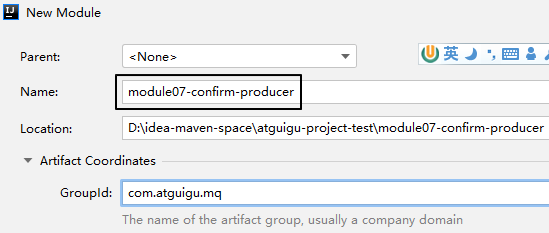

# 操作008-01-A：生产者端消息确认机制

# 一、创建module




# 二、搭建环境

## 1、配置POM

```xml
<parent>
    <groupId>org.springframework.boot</groupId>
    <artifactId>spring-boot-starter-parent</artifactId>
    <version>3.1.5</version>
</parent>

<dependencies>
    <dependency>
        <groupId>org.springframework.boot</groupId>
        <artifactId>spring-boot-starter-amqp</artifactId>
    </dependency>
    <dependency>
        <groupId>org.springframework.boot</groupId>
        <artifactId>spring-boot-starter-test</artifactId>
    </dependency>
    <dependency>
        <groupId>org.projectlombok</groupId>
        <artifactId>lombok</artifactId>
    </dependency>
</dependencies>
```


## 2、主启动类

没有特殊设定：

```java
package com.atguigu.mq;  
  
import org.springframework.boot.SpringApplication;  
import org.springframework.boot.autoconfigure.SpringBootApplication;  
  
@SpringBootApplication/**
 * @Author 千羽
 * @公众号 程序员千羽
 * @Date 2024/5/29 16:00
 * @Version 1.0
 */
public class RabbitMQProducerMainType {

    public static void main(String[] args) {
        SpringApplication.run(RabbitMQProducerMainType.class, args);  
    }

}
```


## 3、YAML

<span style="color:blue;font-weight:bold;">注意</span>：publisher-confirm-type和publisher-returns是两个必须要增加的配置，如果没有则本节功能不生效

```yaml
spring:
  rabbitmq:
    host: 192.168.200.100
    port: 5672
    username: guest
    password: 123456
    virtual-host: /
    publisher-confirm-type: CORRELATED # 交换机的确认
    publisher-returns: true # 队列的确认
logging:
  level:
    com.atguigu.mq.config.MQProducerAckConfig: info
```


# 三、创建配置类

## 1、目标

在这里我们为什么要创建这个配置类呢？首先，我们需要声明回调函数来接收RabbitMQ服务器返回的确认信息：

| 方法名            | 方法功能                 | 所属接口        | 接口所属类     |
| ----------------- | ------------------------ | --------------- | -------------- |
| confirm()         | 确认消息是否发送到交换机 | ConfirmCallback | RabbitTemplate |
| returnedMessage() | 确认消息是否发送到队列   | ReturnsCallback | RabbitTemplate |


然后，就是对RabbitTemplate的功能进行增强，因为回调函数所在对象必须设置到RabbitTemplate对象中才能生效。

原本RabbitTemplate对象并没有生产者端消息确认的功能，要给它设置对应的组件才可以。

而设置对应的组件，需要调用RabbitTemplate对象下面两个方法：

| 设置组件调用的方法   | 所需对象类型            |
| -------------------- | ----------------------- |
| setConfirmCallback() | ConfirmCallback接口类型 |
| setReturnCallback()  | ReturnCallback接口类型  |


## 2、API说明

### ①ConfirmCallback接口

这是RabbitTemplate内部的一个接口，源代码如下：

```java
	/**
	 * A callback for publisher confirmations.
	 *
	 */
	@FunctionalInterface
	public interface ConfirmCallback {

		/**
		 * Confirmation callback.
		 * @param correlationData correlation data for the callback.
		 * @param ack true for ack, false for nack
		 * @param cause An optional cause, for nack, when available, otherwise null.
		 */
		void confirm(@Nullable CorrelationData correlationData, boolean ack, @Nullable String cause);

	}
```

生产者端发送消息之后，回调confirm()方法

- ack参数值为true：表示消息成功发送到了交换机
- ack参数值为false：表示消息没有发送到交换机


### ②ReturnCallback接口

同样也RabbitTemplate内部的一个接口，源代码如下：

```java
	/**
	 * A callback for returned messages.
	 *
	 * @since 2.3
	 */
	@FunctionalInterface
	public interface ReturnsCallback {

		/**
		 * Returned message callback.
		 * @param returned the returned message and metadata.
		 */
		void returnedMessage(ReturnedMessage returned);

	}
```

<span style="color:blue;font-weight:bold;">注意</span>：接口中的returnedMessage()方法<span style="color:blue;font-weight:bold;font-size:25px;">仅</span>在消息<span style="color:blue;font-weight:bold;font-size:25px;">没有</span>发送到队列时调用

ReturnedMessage类中主要属性含义如下：

| 属性名     | 类型                                  | 含义                         |
| ---------- | ------------------------------------- | ---------------------------- |
| message    | org.springframework.amqp.core.Message | 消息以及消息相关数据         |
| replyCode  | int                                   | 应答码，类似于HTTP响应状态码 |
| replyText  | String                                | 应答码说明                   |
| exchange   | String                                | 交换机名称                   |
| routingKey | String                                | 路由键名称                   |


## 3、配置类代码

### ①要点1

加@Component注解，加入IOC容器


### ②要点2

配置类自身实现ConfirmCallback、ReturnCallback这两个接口，然后通过this指针把配置类的对象设置到RabbitTemplate对象中。

操作封装到了一个专门的void init()方法中。

为了保证这个void init()方法在应用启动时被调用，我们使用@PostConstruct注解来修饰这个方法。

关于@PostConstruct注解大家可以参照以下说明：

> @PostConstruct注解是<span style="color:blue;font-weight:bolder;">Java中的一个标准注解</span>，它用于指定在<span style="color:blue;font-weight:bolder;">对象创建之后立即执行</span>的方法。当使用依赖注入（如Spring框架）或者其他方式创建对象时，@PostConstruct注解可以确保在对象完全初始化之后，执行相应的方法。
>
> 使用@PostConstruct注解的方法必须满足以下条件：
>
> 1. <span style="color:blue;font-weight:bolder;">方法不能有任何参数</span>。
> 2. <span style="color:blue;font-weight:bolder;">方法必须是非静态的</span>。
> 3. <span style="color:blue;font-weight:bolder;">方法不能返回任何值</span>。
>
> 当容器实例化一个带有@PostConstruct注解的Bean时，它会在<span style="color:blue;font-weight:bolder;">调用构造函数之后</span>，并在<span style="color:blue;font-weight:bolder;">依赖注入完成之前</span>调用被@PostConstruct注解标记的方法。这样，我们可以在该方法中进行一些初始化操作，比如读取配置文件、建立数据库连接等。


### ③代码

有了以上说明，下面我们就可以展示配置类的整体代码：

```java
package com.atguigu.mq.config;

import jakarta.annotation.PostConstruct;
import lombok.extern.slf4j.Slf4j;
import org.springframework.amqp.core.ReturnedMessage;
import org.springframework.amqp.rabbit.connection.CorrelationData;
import org.springframework.amqp.rabbit.core.RabbitTemplate;
import org.springframework.beans.factory.annotation.Autowired;
import org.springframework.stereotype.Component;

@Component
@Slf4j/**
 * @Author 千羽
 * @公众号 程序员千羽
 * @Date 2024/5/29 16:00
 * @Version 1.0
 */
public class MQProducerAckConfig implements RabbitTemplate.ConfirmCallback, RabbitTemplate.ReturnsCallback{

    @Autowired
    private RabbitTemplate rabbitTemplate;

    @PostConstruct
    public void init() {
        rabbitTemplate.setConfirmCallback(this);
        rabbitTemplate.setReturnsCallback(this);
    }

    @Override
    public void confirm(CorrelationData correlationData, boolean ack, String cause) {
        if (ack) {
            log.info("消息发送到交换机成功！数据：" + correlationData);
        } else {
            log.info("消息发送到交换机失败！数据：" + correlationData + " 原因：" + cause);
        }
    }

    @Override
    public void returnedMessage(ReturnedMessage returned) {
        log.info("消息主体: " + new String(returned.getMessage().getBody()));
        log.info("应答码: " + returned.getReplyCode());
        log.info("描述：" + returned.getReplyText());
        log.info("消息使用的交换器 exchange : " + returned.getExchange());
        log.info("消息使用的路由键 routing : " + returned.getRoutingKey());
    }
}
```


# 四、发送消息

```java
package com.atguigu.mq.test;
  
import org.junit.jupiter.api.Test;
import org.springframework.amqp.rabbit.core.RabbitTemplate;
import org.springframework.beans.factory.annotation.Autowired;
import org.springframework.boot.test.context.SpringBootTest;

@SpringBootTest  /**
 * @Author 千羽
 * @公众号 程序员千羽
 * @Date 2024/5/29 16:00
 * @Version 1.0
 */
public class RabbitMQTest {  
  
    public static final String EXCHANGE_DIRECT = "exchange.direct.order";
    public static final String ROUTING_KEY = "order";
  
    @Autowired  
    private RabbitTemplate rabbitTemplate;
  
    @Test  
    public void testSendMessage() {  
        rabbitTemplate.convertAndSend(  
                EXCHANGE_DIRECT,   
                ROUTING_KEY,   
                "Hello atguigu");  
    }  
  
}
```

通过调整代码，测试如下三种情况：

- 交换机正确、路由键正确
- 交换机正确、路由键不正确，无法发送到队列
- 交换机不正确，无法发送到交换机