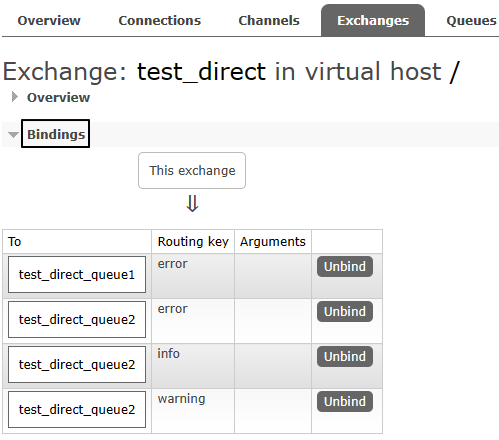

# 路由模式

# 一、生产者代码

```java
package com.atguigu.rabbitmq.routing;  
  
import com.atguigu.rabbitmq.util.ConnectionUtil;  
import com.rabbitmq.client.BuiltinExchangeType;  
import com.rabbitmq.client.Channel;  
import com.rabbitmq.client.Connection;  
import com.rabbitmq.client.ConnectionFactory;  
  /**
 * @Author 千羽
 * @公众号 程序员千羽
 * @Date 2024/5/29 16:00
 * @Version 1.0
 */
public class Producer {  
  
    public static void main(String[] args) throws Exception {  
  
      Connection connection = ConnectionUtil.getConnection();  
  
      Channel channel = connection.createChannel();  
  
      String exchangeName = "test_direct";  
  
      // 创建交换机  
      channel.exchangeDeclare(exchangeName,BuiltinExchangeType.DIRECT,true,false,false,null);  
  
      // 创建队列  
      String queue1Name = "test_direct_queue1";  
      String queue2Name = "test_direct_queue2";  
  
      // 声明（创建）队列  
      channel.queueDeclare(queue1Name,true,false,false,null);  
      channel.queueDeclare(queue2Name,true,false,false,null);  
  
      // 队列绑定交换机  
      // 队列1绑定error  
      channel.queueBind(queue1Name,exchangeName,"error");  
  
      // 队列2绑定info error warning  
      channel.queueBind(queue2Name,exchangeName,"info");  
      channel.queueBind(queue2Name,exchangeName,"error");  
      channel.queueBind(queue2Name,exchangeName,"warning");  
  
        String message = "日志信息：张三调用了delete方法.错误了,日志级别warning";  
  
        // 发送消息  
        channel.basicPublish(exchangeName,"warning",null,message.getBytes());  
        System.out.println(message);  
  
      // 释放资源  
        channel.close();  
        connection.close();  
  
    }  
  
}
```


# 二、消费者代码

## 1、消费者1号

```java
package com.atguigu.rabbitmq.routing;  
  
import com.atguigu.rabbitmq.util.ConnectionUtil;  
import com.rabbitmq.client.*;  
import java.io.IOException;  
  /**
 * @Author 千羽
 * @公众号 程序员千羽
 * @Date 2024/5/29 16:00
 * @Version 1.0
 */
public class Consumer1 {  
  
    public static void main(String[] args) throws Exception {  
  
        Connection connection = ConnectionUtil.getConnection();  
  
        Channel channel = connection.createChannel();  
  
        String queue1Name = "test_direct_queue1";  
  
        channel.queueDeclare(queue1Name,true,false,false,null);  
  
        Consumer consumer = new DefaultConsumer(channel){  
  
            @Override  
            public void handleDelivery(String consumerTag, Envelope envelope, AMQP.BasicProperties properties, byte[] body) throws IOException {  
  
                System.out.println("body："+new String(body));  
                System.out.println("Consumer1 将日志信息打印到控制台.....");  
  
            }  
  
        };  
  
        channel.basicConsume(queue1Name,true,consumer);  
  
    }  
  
}
```


## 2、消费者2号

```java
package com.atguigu.rabbitmq.routing;  
  
import com.atguigu.rabbitmq.util.ConnectionUtil;  
import com.rabbitmq.client.*;  
import java.io.IOException;  
  /**
 * @Author 千羽
 * @公众号 程序员千羽
 * @Date 2024/5/29 16:00
 * @Version 1.0
 */
public class Consumer2 {  
  
    public static void main(String[] args) throws Exception {  
  
        Connection connection = ConnectionUtil.getConnection();  
  
        Channel channel = connection.createChannel();  
  
        String queue2Name = "test_direct_queue2";  
  
        channel.queueDeclare(queue2Name,true,false,false,null);  
  
        Consumer consumer = new DefaultConsumer(channel){  
  
            @Override  
            public void handleDelivery(String consumerTag, Envelope envelope, AMQP.BasicProperties properties, byte[] body) throws IOException {  
  
                System.out.println("body："+new String(body));  
                System.out.println("Consumer2 将日志信息存储到数据库.....");  
  
            }  
  
        };  
  
        channel.basicConsume(queue2Name,true,consumer);  
  
    }  
  
}
```


# 三、运行结果

## 1、绑定关系




## 2、消费消息

