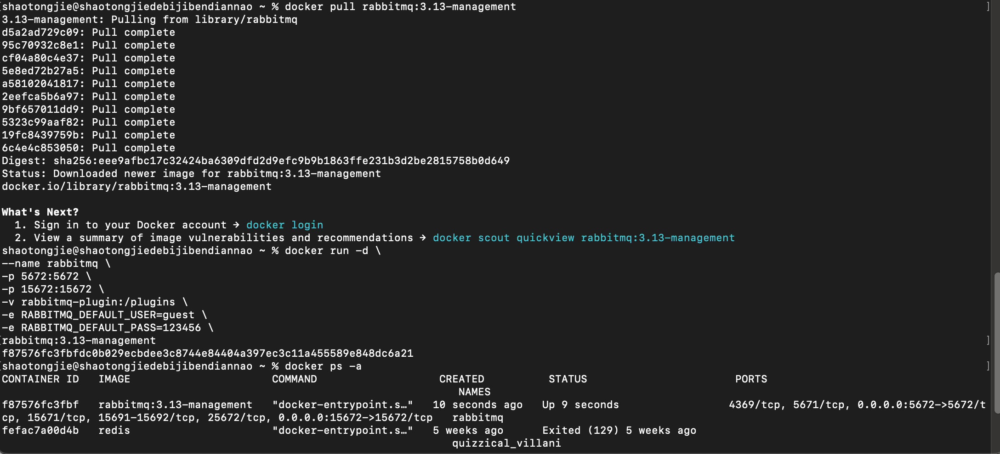
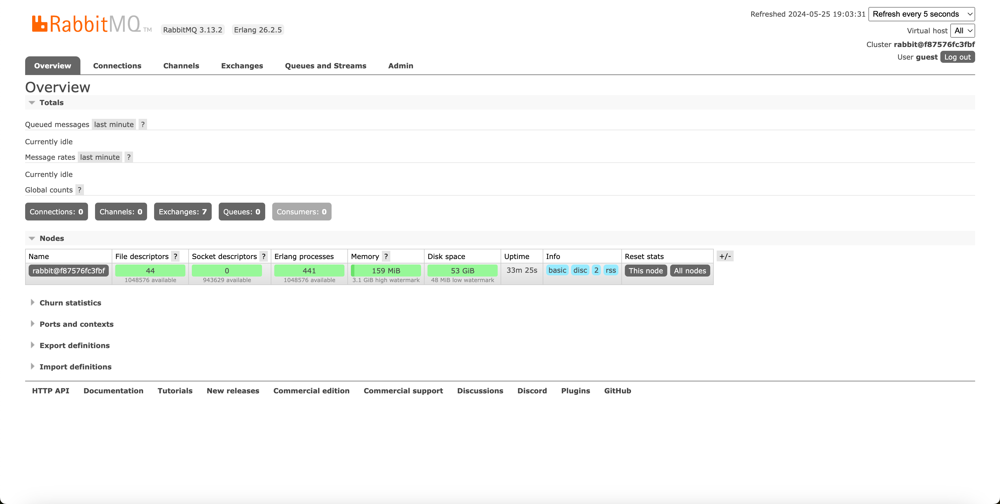
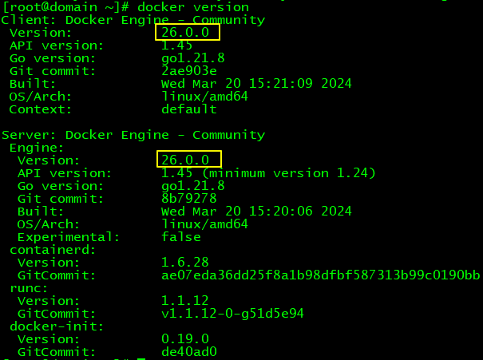

## 前置要求

前提需要掌握以下技术栈

1. SpringBoot
2. SpringCloud
3. Docker
4. Maven

## 什么是消息队列、

消息队列是实现**应用程序**和**应用程序**之间**通信**的中间件产品


消息队列底层实现的两大主流方式
 • 由于消息队列执行的是跨应用的信息传递，所以制定**底层通信标准**非常必要

• 目前主流的消息队列通信协议标准包括:

• AMQP(**A**dvanced **M**essage **Q**ueuing **P**rotocol):**通用**协议，IBM公司研发

• JMS(**J**ava **M**essage **S**ervice):**专门**为**Java**语言服务，SUN公司研发，一组由Java接口组成 的Java标准


消息队列（Message Queue）是一个在计算机科学中广泛使用的概念，主要用于异步通信、应用解耦、流量削峰等场景。

简单来说，它就像是一个快递小哥，把快递送到**牛马打工人**手中就去下个站点配送，**牛马打工人**什么时候下来拿快递，不需要管了。

以快递小哥为例，我们可以这样理解消息队列：

1. **快递小哥（消费者）**：负责接收和派送包裹（消息）的人。
2. **快递公司（消息队列系统）**：负责管理包裹的存放和分发，确保包裹能够准确无误地送达给收件人。
3. **寄件人（生产者）**：需要将包裹寄送给收件人的人，他们会将包裹送到快递公司的某个网点或邮筒。
4. **邮筒（队列）**：存放包裹的地方，可以是快递公司的一个实体网点，也可以是一个虚拟的存储空间（在内存中或持久化到磁盘上）。


现在，我们来看看这个场景是如何工作的：

1. 寄件人（**生产者**）将包裹（**消息**）投放到快递公司的某个网点或邮筒（**队列**）中，并指定收件人的地址。
2. 快递公司（**消息队列系统**）会接收这个包裹，并将其存放到相应的邮筒（**队列**）中。
3. 快递小哥（**消费者**）会定期或实时地从邮筒（**队列**）中取出包裹，并根据收件人的地址进行派送。
4. 如果包裹太多，一个快递小哥忙不过来，快递公司可以安排多个快递小哥（**多个消费者**）来同时处理这些包裹。

这个例子中，消息队列的优势主要体现在以下几个方面：

* **异步通信**：寄件人（生产者）和收件人（消费者）不需要实时在线，他们可以通过快递公司（消息队列系统）进行异步通信。
* **应用解耦**：快递公司（消息队列系统）作为中间层，将寄件人（生产者）和收件人（消费者）解耦，使得他们可以独立地扩展和修改。
* **流量削峰**：在高峰期，大量的包裹可能会同时到达快递公司，但快递公司可以通过邮筒（队列）进行缓冲，避免系统崩溃，并确保包裹能够有序地派送。


下单功能【同步】 问题1:功能耦合度高

下单功能【异步】 功能解耦


下单功能【同步】 问题2:响应时间长

下单功能【异步】 快速响应


下单功能【同步】 问题3:并发压力传递

下单功能【异步】 削峰限流

削峰限流的好处

在消息队列的协助下，峰值流量下降，服务器运行更稳定

任务转移到相对空闲的时间段处理，资源利用更充分


下单功能【同步】 问题4:系统结构弹性不足

下单功能【异步】 便于扩展


同 步

- 系统耦合度高
- 并发压力持续向后续服务传导
- 系统结构缺乏弹性，可扩展性差
- 响应时间长

异 步

- 参与的各功能模块相对独立，耦合度低
- 借助消息队列实现流量削峰填谷
- 各功能模块对接消息队列，系统功能扩展方便
- 快速响应

注 意

并不是把所有交互方式都改成异步
 • **强关联**调用还是通过OpenFeign进行

同步调用
 • **弱关联**、**可独立拆分出来**的功能使用

消息队列进行异步调用


## RabbitMQ介绍

官网地址:https://www.rabbitmq.com/

• Logo:

• RabbitMQ是一款**基于AMQP**、**由Erlang语言开发的消息队列产品，2007年 Rabbit技术公司发布了它的1.0版本

## RabbitMQ体系结构介绍

Producer

```
消息的发送端，也可以称为消息的生产者
```


Consumer

```
消息的接收端，也可以称为消息的消费者
```


消息发送端或消息消费端到消息队列主体服务器之间的TCP连接


建立TCP连接需要三次握手，反复确认。 所以如果每一次访问RabbitMQ服务器都建立一个Connection开销会极大，效率低下。 所以Channel就是在一个已经建立的Connection中建立的逻辑连接。 如果应用程序支持多线程，那么每个线程创建一个单独的Channel进行通讯。 每个Channel都有自己的id，Channel之间是完全隔离的。 总之核心点就是:实现**Connection****复用**


## RabbitMQ安装、


RabbitMQ的各种工作模式


# 操作001：RabbitMQ安装

# 一、安装

```shell
# 拉取镜像
docker pull rabbitmq:3.13-management

# -d 参数：后台运行 Docker 容器
# --name 参数：设置容器名称
# -p 参数：映射端口号，格式是“宿主机端口号:容器内端口号”。5672供客户端程序访问，15672供后台管理界面访问
# -v 参数：卷映射目录
# -e 参数：设置容器内的环境变量，这里我们设置了登录RabbitMQ管理后台的默认用户和密码
docker run -d \
--name rabbitmq \
-p 5672:5672 \
-p 15672:15672 \
-v rabbitmq-plugin:/plugins \
-e RABBITMQ_DEFAULT_USER=guest \
-e RABBITMQ_DEFAULT_PASS=123456 \
rabbitmq:3.13-management
```


<br/>



# 二、验证

访问后台管理界面：http://localhost:15672


<br/>

使用上面创建Docker容器时指定的默认用户名、密码登录：


<br/>




<br/>

# 三、可能的问题

## 1、问题现象

在使用Docker拉取RabbitMQ镜像的时候，如果遇到提示：missing signature key，那就说明Docker版本太低了，需要升级

## 2、解决办法

> 基于CentOS7

### ①卸载当前Docker

更好的办法是安装Docker前曾经给服务器拍摄了快照，此时恢复快照；

如果不曾拍摄快照，那只能执行卸载操作了

```shell
yum erase -y docker \
	docker-client \
	docker-client-latest \
	docker-common \
	docker-latest \
	docker-latest-logrotate \
	docker-logrotate \
	docker-selinux \
	docker-engine-selinux \
	docker-engine \
	docker-ce
```


### ②升级yum库

```shell
yum update -y
```


### ③安装Docker最新版

```shell
yum install -y docker-ce docker-ce-cli containerd.io docker-buildx-plugin docker-compose-plugin
```


如果这一步看到提示：没有可用软件包 docker-ce，那就添加Docker的yum源：

```shell
yum install -y yum-utils
yum-config-manager --add-repo https://download.docker.com/linux/centos/docker-ce.repo
```


### ④设置Docker服务

```shell
systemctl start docker
systemctl enable docker
```


## 3、验证

上述操作执行完成后，再次查看Docker版本：


